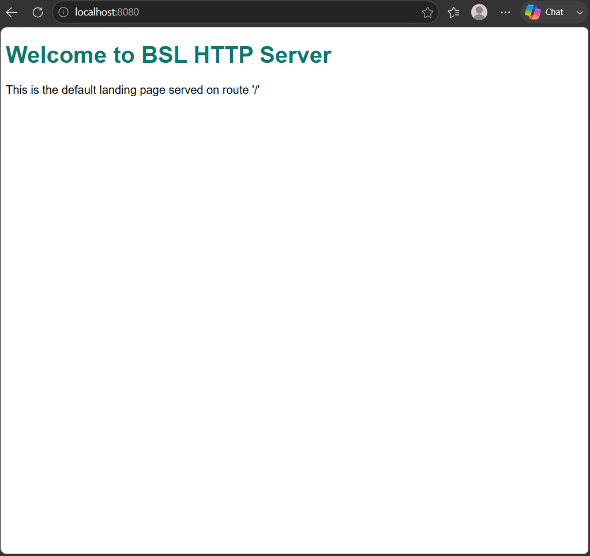
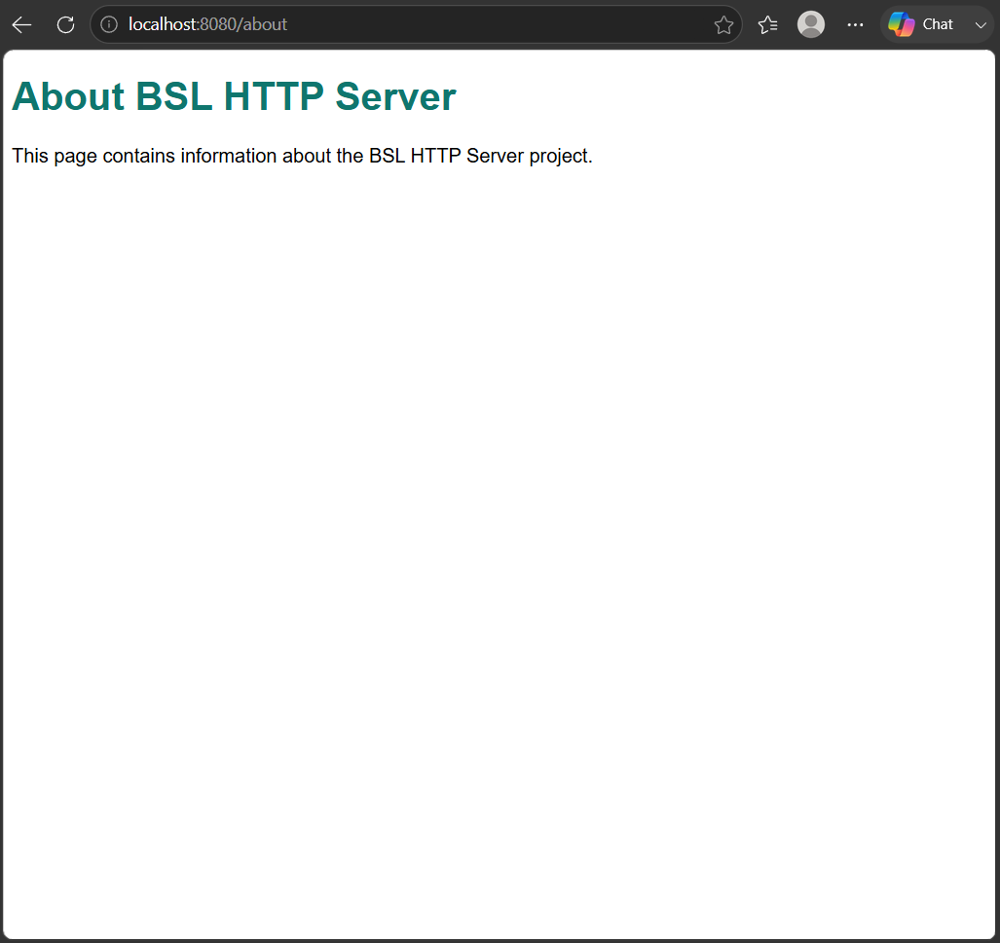
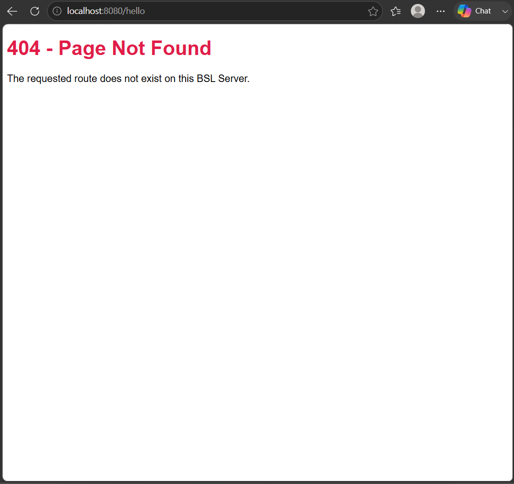
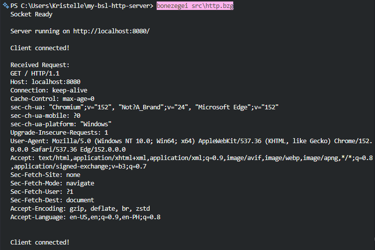

# BSL HTTP Server

A lightweight, non-blocking HTTP web server built using the **Bonezegei Scripting Language (BSL)** and low-level socket programming. This project implements raw TCP socket bindings to handle incoming client connections, process HTTP/1.1 request strings, and serve dynamic HTML responses and appropriate HTTP status codes.

---

## Table of Contents

- [Project Description](#project-description)
- [Features](#features)
- [Repository Structure](#repository-structure)
- [Installation & Setup Guide](#installation--setup-guide)
- [Usage Instructions](#usage-instructions)
- [Route Handlers](#route-handlers)
- [Documentation & Screenshots](#documentation--screenshots)
- [License](#license)

---

## Project Description

This project demonstrates core networking principles, socket programming, and HTTP protocol mechanics using **Bonezegei (BSL)**. Operating on port `8080`, the application handles incoming TCP connections from standard web browsers, parses raw HTTP request headers, and delivers compliant HTTP/1.1 response envelopes carrying headers and HTML payloads.

The project highlights:

* Low-level network socket lifecycles (initialization, socket creation, address binding, listening, and accepting client connections).
* Raw string inspection for path-based HTTP routing.
* Proper handling of standard HTTP response headers (`200 OK`, `404 Not Found`, `Content-Type`, `Content-Length`, `Connection: close`).
* Memory management using manual garbage collection (`gc()`) on closed connections.

---

## Features

* **Pure BSL Socket Implementation**: Direct interaction with the native socket library.
* **Path Routing**: Built-in routing for predefined endpoints and fallback mechanics for unmapped routes.
* **RFC-Compliant HTTP Responses**: Formatted headers paired with HTML payloads.
* **Resource Management**: Explicit socket closure and garbage collection per request cycle to prevent resource exhaustion.

---

## Repository Structure

```text
my-bsl-http-server/
├── .gitattributes
├── LICENSE
├── README.md
├── src/
│   └── http.bzg
└── documentation/
    ├── home.png
    ├── about.png
    ├── 404.png
    └── terminal.png
```

---

## Installation & Setup Guide

### 1. Prerequisites

* **Bonezegei (BSL) Interpreter**: Install the BSL interpreter (Windows via Microsoft Store, or Linux/Raspberry Pi via `.deb` — see the [BSL install guide](https://bonezegei.com/tutorials/bsl/install)).  
  Verify the install:
  ```bash
  bonezegei --version
  ```
* **Git**: Installed and configured on your machine.

### 2. Clone the Repository

```bash
git clone https://github.com/Kris2103/my-bsl-http-server.git
cd my-bsl-http-server

```

### 3. Install Socket Library

The server relies on the BSL native socket bindings. Install the socket dependency locally into the project root:

```bash
bzg install socket

```

> **Note:** This command creates a local `lib/` directory containing `socket.bzg` and platform-specific socket binaries required for runtime execution.

### 4. Run the Server

Execute the entry script from the project root:

```bash
bonezegei src/http.bzg

```

Upon successful startup, your terminal will display:

```text
Socket Ready
Server running on http://localhost:8080/

```

---

## Usage Instructions

Once the server is running, open any standard web browser or use a command-line tool like `curl` to interact with the endpoints:

| Endpoint | Expected Status | Description |
| --- | --- | --- |
| `http://localhost:8080/` | `200 OK` | Renders the primary landing page. |
| `http://localhost:8080/about` | `200 OK` | Renders the project information page. |
| `http://localhost:8080/anything` | `404 Not Found` | Renders the fallback error page for unmapped routes. |

To shut down the server, press `Ctrl + C` in your active terminal.

---

## Route Handlers

### 1. Root Route (`/`)

* **Method:** `GET`
* **Response Code:** `200 OK`
* **Content-Type:** `text/html`
* **Output:** Welcome banner and server status message.

### 2. About Route (`/about`)

* **Method:** `GET`
* **Response Code:** `200 OK`
* **Content-Type:** `text/html`
* **Output:** Overview of the BSL HTTP Server project specifications.

### 3. Fallback Route (`404`)

* **Method:** `GET` (Any unmapped path)
* **Response Code:** `404 Not Found`
* **Content-Type:** `text/html`
* **Output:** Standard error notification stating that the resource was not found.

---

## Documentation & Screenshots

### 1. Root Route (`/`)

Landing page served on `http://localhost:8080/` with a `200 OK` status.



---

### 2. About Route (`/about`)

Informational route served on `http://localhost:8080/about` with a `200 OK` status.



---

### 3. 404 Not Found Route

Fallback page served on arbitrary paths (e.g., `http://localhost:8080/anything`) returning an HTTP `404 Not Found` status.



---

### 4. Terminal Output

Execution output displaying server startup, incoming connections, raw request parsing, and system directory/user path.



## License

This project is licensed under the MIT License - see the [LICENSE](LICENSE) file for details.
